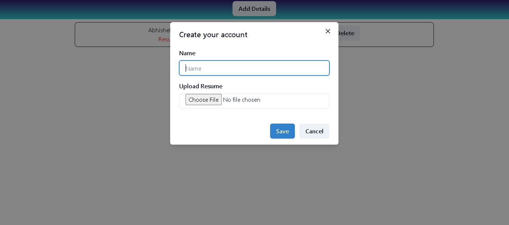

# Resume-App

This project is a web application built with React, Express, and MySQL, allowing users to upload PDF resumes and view them in a dashboard.

## Features

- **PDF Upload**: Users can upload their PDF resumes along with their names.
- **Dashboard**: View uploaded PDF resumes in a dashboard.
- **MySQL Database**: The application stores resume data in a MySQL database.

## Technologies Used

- **React**: Frontend framework for building the user interface.
- **Express**: Backend framework for handling server-side logic and API endpoints.
- **MySQL**: Relational database management system for storing resume data.
- **Multer**: Node.js middleware for handling multipart/form-data, used for file uploads.
- **Axios**: Promise-based HTTP client for making requests to the backend API.

## Screenshots




## Deployed Link

- Frontend

https://resume-app-orpin-one.vercel.app/

- Backend

https://resume-app-526c.onrender.com

## Installation

1. Clone the repository:

```bash
git clone https://github.com/DevWebAbhi/Resume-App.git

